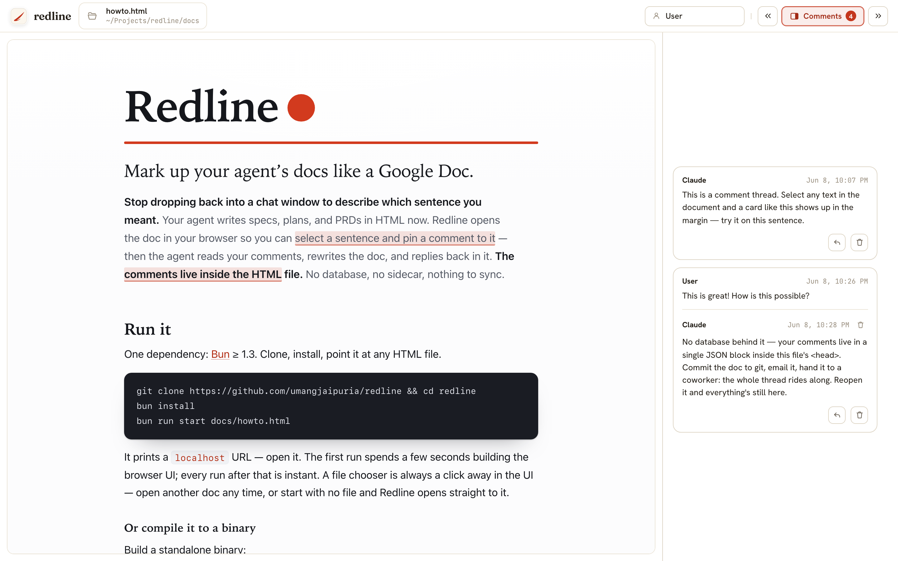

# Redline

Agents write more and more of our plans, specs, and docs — and increasingly in HTML rather than Markdown, because HTML renders into something a human can easily read, navigate, and react to. (See Thariq Shihipar's ["HTML is the new markdown"](https://x.com/trq212/status/2052811606032269638).)

But collaborating on those documents with your AI agent — asking questions, digging into a specific line, pushing back — is still painful. You read the rendered page, then drop back into a chat window to paste a snippet, type your reaction, paste the next, and so on. The agent guesses at what you meant, edits, and you scroll back to check. Slow and lossy.

Enter Redline — a local app that opens an agent-written HTML document in your browser and lets you comment on it like a Google Doc. Select text, leave a comment, reply. Your agent reads those comments, revises the document, and replies inline. The document and all of its open review state live in the same HTML file, so there's nothing extra to sync.

**Why Redline**

- **Local and private.** The server runs on your machine and binds to `127.0.0.1` — your documents never leave your computer.
- **Made for complex docs.** Anchored, in-margin comments beat describing "the third bullet under *Rollout*" in a chat box. The longer and denser the document, the bigger the win.
- **HTML-first.** You review the rendered document your agent actually wrote — not a flattened Markdown stand-in.
- **Use any agent.** Claude Code, Codex, Cursor, opencode, OpenClaw — anything that can follow a skill or an `AGENTS.md` and run a CLI.
- **Lives in one file.** No database, no sidecar: comments sit in a single block inside the HTML. Commit it to git or send it to a coworker and the open review travels with it.



## Getting started

1. **Clone the repo.**

   ```bash
   git clone https://github.com/umangjaipuria/redline.git && cd redline
   ```

2. **Install dependencies** (requires [Bun](https://bun.sh) ≥ 1.3).

   ```bash
   bun install
   ```

3. **Install the review skill** so your agent knows how to work with Redline documents. Symlink it into your agent's skills directory:

   ```bash
   # Claude Code
   ln -s "$(pwd)/.claude/skills/redline-review" ~/.claude/skills/redline-review

   # Codex
   ln -s "$(pwd)/.agents/skills/redline-review" ~/.agents/skills/redline-review
   ```

   Any other agent can be pointed at this repo's `AGENTS.md`, which carries the same guidance.

4. **Open a document.** Pass any HTML file; Redline serves it and prints a localhost URL to open in your browser. The first run builds the browser UI automatically (a few seconds); after that it starts instantly.

   ```bash
   bun run start docs/howto.html
   ```

   With no path — or a path that isn't an existing HTML file — Redline starts with no document open and prompts you
   to choose one in the browser (the bundled `docs/howto.html` guide is offered as a starting point). Redline
   only reviews files that already exist; it never creates one for you.

   ```bash
   bun run start
   ```

   Run `bun run start --help` to see all command-line options.

5. **Leave comments.** Select text in the rendered document, click `Comment` (or press `Cmd+Shift+M`), and write your comment. Reply to threads, edit your own messages, or delete a thread once it's handled. In the top bar, set your author name so comments are attributed to you, and show or hide the comments rail. You're the reviewer here — your agent owns the document's text and makes the actual edits; your comments are saved inside the same HTML file.

6. **Ask your agent to review the comments.** Tell Claude (or whichever agent wrote the doc) to review the open comments using the **redline-review** skill. It reads the threads, revises the document, replies to each thread with what changed, and deletes the threads that are fully resolved. The skill tells the agent how to find the running Redline instance on its own; if it can't, just give it the localhost URL the server printed.

7. **Iterate.** Agent edits show up live in the open browser. Read the replies, leave new comments, and go again until the document is right. The agent doesn't watch for new comments on its own, so each time you finish a round of comments, tell it to review them again.

## Building and running

Redline needs only [Bun](https://bun.sh) ≥ 1.3 — no other toolchain. Bun runs the
TypeScript server and CLI directly; the only thing that gets built is the browser
client, which Bun bundles to `dist/`.

```bash
bun install                          # install dependencies (Preact)
bun run start docs/howto.html        # start the review server; prints a localhost URL (default :7331)
```

| Command | What it does |
| --- | --- |
| `bun run build:client` | Bundle the Preact client (`src/client`) to `dist/`. `bun run start` does this automatically on first run; run it by hand to rebuild after changing client code. |
| `bun run start [file] [--port N] [--host H]` | Start the server. With a file it opens that document; with none, the browser prompts you to pick one. **If a Redline server is already running, the file is opened on that server** (one shared server holds many documents) and its URL is printed — pass `--port N` to run a separate server on another port instead. Binds to `127.0.0.1` by default; binding elsewhere needs `REDLINE_ALLOW_REMOTE=1` because the local API is unauthenticated. |
| `bun run dev` | Start the server with `--watch` (auto-restart on server-code changes). The client bundle is not watched — re-run `build:client` after client edits. |
| `bun src/agent/cli.ts <command>` | The `redline` CLI (see [How agents talk to Redline](#how-agents-talk-to-redline)). Run `bun link` once to expose it globally as `redline`. |
| `bun test` | Run the test suite. |
| `bun run test:browser` | Build the client, install Chromium into `.test-artifacts/playwright/browsers/` if needed, and run the Playwright browser tests. |
| `bun run check` | Typecheck (`tsc --noEmit`), run the Bun tests, and run the Playwright browser tests. |
| `bun run coverage` | Run Bun test coverage. Reports are written under `.test-artifacts/coverage/unit/`. |
| `bun run coverage:all` | Run Bun coverage plus Playwright browser V8 coverage. Browser coverage is summarized separately from Bun's source-line table. |
| `bun run build:binary` | Build the client into `dist/`, then compile a standalone server executable to `./redline` with the web client and static assets embedded. |
| `bun run clean` | Remove local generated/install artifacts (`node_modules/`, `dist/`, `.test-artifacts/`, compiled `redline` binaries, and Bun compile scratch files). |

Notes:

- **The client is built automatically.** `bun run start` bundles the UI into `dist/` on first run (it's gitignored), so users never run a build step. **Only if you're editing the client source** (`src/client`) do you rebuild by hand with `build:client` afterward — auto-build fires only when the bundle is missing, not when it's stale, and `bun run dev` watches server code, not the client.
- **`build:binary` embeds the browser UI.** The compiled `./redline` executable serves the built client, favicon, and local fonts from the binary itself, so it does not need `dist/` or `public/` beside it at runtime.
- **Run the CLI** either as `bun src/agent/cli.ts <command>` or, after `bun link`, as `redline <command>`. Every command takes a file path; it routes through a running server automatically when one has the file open, and otherwise edits the file directly.

## How review state lives in the file

Everything lives in one HTML file — no database, no sidecar.

**The state block.** Comment threads are stored in a single inert JSON block in the `<head>`:

```html
<script type="application/json" id="redline-state">
  { "schemaVersion": 2, "updatedAt": "...", "threads": [ ... ] }
</script>
```

**The discovery marker.** On first write, Redline stamps a one-line marker so agents know to use the `redline-review` skill:

```html
<meta name="redline-agent-guide" content="Redline review document. Agents: use the redline-review skill; review state is in the #redline-state block.">
```

That block and marker are the **only** bytes Redline adds — the rest of the document stays byte-for-byte what the author wrote. No inline anchor markers; highlights are drawn in the browser at view time. When the last thread is deleted, the block is removed entirely.

**Anchoring.** Each thread anchors by `quote` plus a little surrounding `prefix`/`suffix`, not a fixed offset. On every load, Redline re-resolves each anchor against the current text (with a fuzzy fallback) and classifies it as:

- **anchored** — clean match
- **needs-review** — low-confidence match, flagged
- **orphaned** — no match, kept in the rail with its last-known quote

When the agent rewrites text a comment was on, the comment follows automatically. Only a wholesale rewrite orphans it — and even then it surfaces for re-attachment, not disappears. Agents never maintain anchors by hand.

**Live updates.** When the server notices the file changed on disk, it refreshes the browser's rendered content and anchor states without rewriting the HTML. Agent edits — through the file, CLI, or API — appear in the open browser without a reload.

## How agents talk to Redline

Agents work through the `redline-review` skill, which wraps the `redline` CLI. Run it as `redline <command>` (after `bun link`) or, in this repo, as `bun src/agent/cli.ts <command>`. Every command takes a **file path** and resolves it to the running server automatically; with no server running, it edits the file directly. Agents pass their own name with `--author` (for example `Claude` or `Codex`); a blank or omitted author falls back to `AI`.

Read feedback without loading the full HTML:

```bash
redline comments <file>              # compact thread list with anchor state
redline anchors  <file> [--in A:B]   # anchor resolution report: anchored / needs-review / orphaned
redline thread   <file> <thread-id>  # one thread in full
redline info     <file>              # document metadata, no content
```

Write comments:

```bash
redline comment <file> "<quoted text>" "<body>" [--occurrence N] --author Claude
redline reply   <file> <thread-id> "<body>" --author Claude
redline edit-message  <file> <thread-id> <message-id> "<body>"
redline delete-reply  <file> <thread-id> <message-id>
redline delete-thread <file> <thread-id>
```

`delete-thread` removes the thread from the state block — this is what used to be "resolve"; there is no separate kept-resolved state. If the quoted text appears more than once, pass `--occurrence N` (1-based, document order); it's a transient hint, resolved to selectors at capture time and never persisted.

Re-anchor and batch. Most edits re-anchor on their own; you only intervene for what reconcile couldn't place (orphaned / needs-review):

```bash
redline reanchor <file> <thread-id> --quote "<new text>" [--occurrence N]
redline apply    <file> <payload.json>   # one atomic batch of comment/anchor ops
```

The `apply` payload mutates only the state block — there is **no content field** (the agent edits the document directly with its own tools):

```json
{
  "comments": [{ "quote": "growth improved by 40%", "body": "Needs a source.", "author": "Claude" }],
  "replies": [{ "threadId": "thread_abc123", "body": "Updated.", "author": "Claude" }],
  "edits": [{ "threadId": "thread_abc123", "messageId": "message_xyz", "body": "Reworded." }],
  "deleteThreads": ["thread_done456"],
  "deleteReplies": [{ "threadId": "thread_abc123", "messageId": "message_old" }],
  "reanchors": [{ "threadId": "thread_orphan1", "quote": "the new phrasing" }]
}
```

The agent loop: `redline anchors <file>` to see which comments sit where you're about to edit → edit the document directly → `redline anchors <file>` again to read the orphaned / needs-review leftovers → `redline reanchor` (or a batch `apply`) only those.

When the server is running, agents can also use HTTP. Everything is document-scoped under `/api/docs/:docId/`, so resolve the path to a `docId` first (it's an ephemeral session handle — always resolve path → docId, never cache it):

```bash
ID=$(redline docid docs/howto.html)
curl http://127.0.0.1:7331/api/docs/$ID/agent/comments/index
curl http://127.0.0.1:7331/api/docs/$ID/agent/comments/thread_abc123
curl -X POST http://127.0.0.1:7331/api/docs/$ID/agent/update \
  -H 'Content-Type: application/json' -d @payload.json
```

Write endpoints accept an optional `expectedVersion`; a mismatch returns `409` with the current state to rebase from. An unknown `docId` returns `404` — re-resolve by path.

The server registers itself at `~/.local/state/redline/servers/<pid>.json` — a fixed per-user path listing its `url`, `pid`, and the `docId` and `path` of each open document, so any tool or agent can find the running server regardless of its working directory. Each running server gets its own pid-named file (so concurrent servers don't collide) and removes it on a clean exit; stale entries left by a hard kill are pruned by the next server to start.
